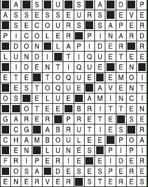
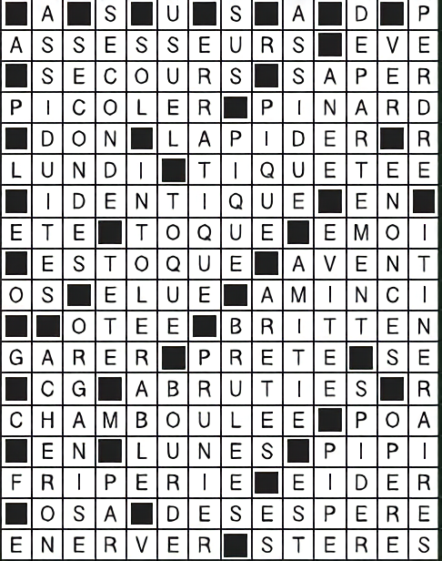

# crosswords_opencv

This repository is an experiment of reading a crosswords grid to a computer understandable structure, with the help of OpenCV and Tesseract's powerful OCR capabilities.

## Current process

### Getting an input image

An input image is one similar to the one in the `samples/` directory.



### Manual pass -- Waifu2X

If the input image is of a too bad quality, it's usually a good idea to run it through Waifu2X to upscale it and clean the noise.



### Setting the grid size

Currently the grid size is still set manually in the code. The algorithm has (for now) to know how does the grid looks like.

For the sample image, the grid is 14 by 18.

### Calling the script

```
./main.py ./samples/waifu2xed.png
```

* The algorithm creates an internal representation of the grid by storing in each cell whether it's a black cell or whether it's a letter.
* If it's a letter, it crops the letter to its bounding box and stores it in the grid.
* From the reconstructed grid, the algorithm now creates a list of all the horizontal and vertical words
* From these words (sequence of cells), the algorithm creates temporary "word images", such as the following:
  
* This word image is sent for OCR to Tesseract.
* The received text is split into each character and they are stored in the grid.
* Thus, since the multiple words use the same characters, we can cross check our OCR
* The grid is then displayed

```
-A-S-U-S-A-D-P
ASSESSEURS-EVE
-SECOURS-SAPER
PICOLER-PINARD
-DON-LAPIDER-R
LUNDI-TIQUETEE
-IDENTIQUE-EN-
ETE-TOQUE-EMOI
-ESTOQUE-AVENT
OS-ELUE-AMINCI
--OTEE-BRITTEN
GARER-PRETE-SE
-CG-ABRUTIES-R
CHAMBOULEE-POA
-EN-LUNES-PIP?
FRIPERIE-EIDER
-OSA-DESESPERE
ENERVER-STERES
```

There are still some bugs (the `?`s) that come from uncertainties about the OCR.
